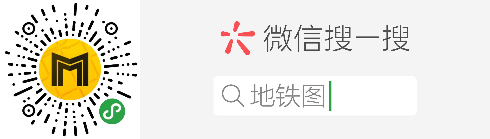
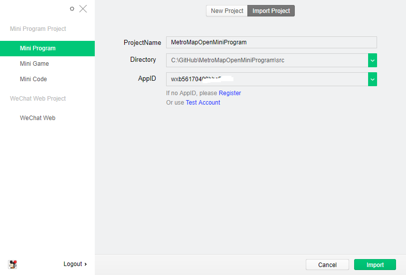
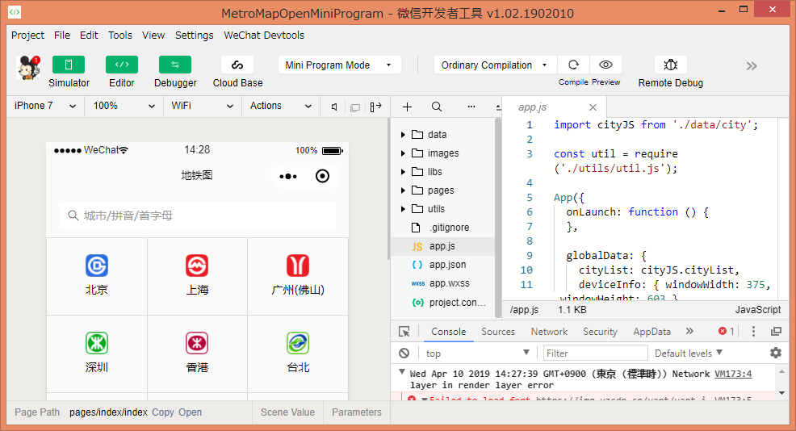
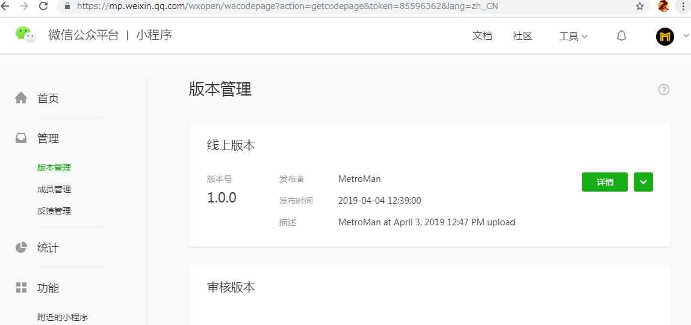
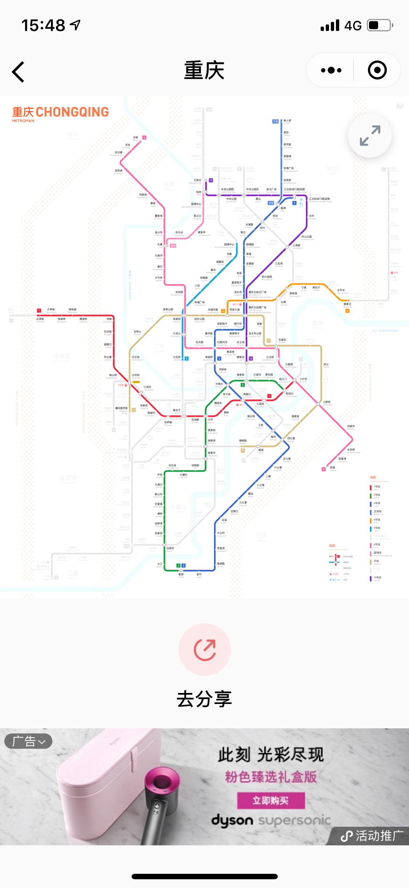
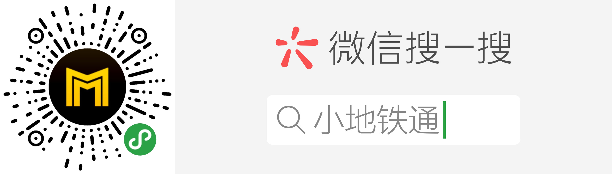

<div align=center></div>

# 地铁图开源小程序

本项目包含了"地铁图"微信小程序的源代码，以及介绍了如何根据这份源代码配置并发布一个属于自己的地铁小程序。

## 截图

<div align=center></div>

## 概述

很多 地铁迷&设计师 绘制了自己风格的地铁线路图，但是苦于不会编程，无法提供高效的展示程序。

本项目以"地铁通-MetroMan"开发的"地铁图"微信小程序为demo，详细介绍了如何利用本程序提供的开源代码，注册配置发布自己的地铁小程序。

## 具体步骤

* 注册小程序账号
* 申请小程序
* 安装小程序开发工具
* 配置小程序源代码
* 预览并发布小程序

### 注册小程序账号

进入[小程序注册页](https://developers.weixin.qq.com/miniprogram/dev/quickstart/basic/getstart.html#%E7%94%B3%E8%AF%B7%E5%B8%90%E5%8F%B7) 根据指引填写信息和提交相应的资料，就可以拥有自己的小程序帐号。

### 申请小程序

注册成功后，登陆[小程序管理平台](https://mp.weixin.qq.com/)，申请你的小程序，管理权限，查看数据报表，发布小程序等操作。

#### 注意点
* 一个小程序账号仅能申请一个小程序
* 小程序名称是唯一的，不能申请其他开发者已占用的名称，申请后改名手续非常繁琐，尽量一次到位
* 所有信息务必如实填写，如：姓名，身份证，手机号码等
* 申请成功后会得到一个"AppID(小程序ID)"，例如：wx3c618f2bd6a*****，记下这个ID，后续配置时会用到


### 安装小程序开发工具

前往 [开发者工具下载页面](https://developers.weixin.qq.com/miniprogram/dev/devtools/download.html?t=19040917) ，根据自己的操作系统下载对应的安装包进行安装。

打开小程序开发者工具，用微信扫码可登录开发者工具。

无须担心，我们不编写任何代码，只是使用这个开发者工具导入本项目的源代码。

选择开发者工具右侧的 + ，然后选择 Import Project，输入项目名称，源代码地址，以及之前申请到的AppID。

<div align=center></div>

按下 Import 按钮后，就完成了导入源代码生成自己的小程序的全过程。

<div align=center></div>

### 配置小程序源代码

#### 配置页面Title

打开 app.json，可以修改App名称。打开 pages\index\index.json，可以首页面的Title。

```
"navigationBarTitleText": "地铁图"
```

#### 配置城市一览

demo程序已涵盖了所有已开通地铁的城市，如果你只想发布其中部分城市，可以打开 data\city.js，删除其余城市即可。

> { key: "bj", lat: 39.908065, lng: 116.411502, name: "北京", english: "Beijing", pinyin: "beijing", py: "bj", other: "" }

> { key: "sh", lat: 31.232844, lng: 121.47537, name: "上海", english: "Shanghai", pinyin: "shanghai", py: "sh", other: "" }

#### 配置地铁Logo

可以使用你自己绘制的各城市地铁Logo替换掉demo中的图标。

> images\logo\logo_bj.png

> images\logo\logo_sh.png

#### 配置地铁图URL

考虑到地铁图更新的便利化，本demo将所有线路图放到服务器上，用户选择城市后会从服务器下载图片并缓存起来。(缓存时间为10分钟)

你需要将demo的URL修改成你自己的URL。打开 data\city.js，修改metroMapUrl为你自己的服务器URL即可。

> metroMapUrl: 'https://metroman.cn/mp/metromap/'

demo的图片存储地址如下：

> https://metroman.cn/mp/metromap/routemap_bj_cn.png （北京地铁线路图）

> https://metroman.cn/mp/metromap/routemap_sh_cn.png （上海地铁线路图）

### 预览并发布小程序

#### 预览小程序

前面已经完成了所有的配置工作，现在我们在手机上测试一下我们的小程序。

点击开发工具右上角的 Preview 按钮，会生成一个预览用的二维码，微信扫一扫即可安装测试。

#### 上传小程序

测试OK后，我们需要先将小程序代码上传到微信服务器上，点击开发工具右上角的 Upload 按钮，输入版本号比如：1.0.0，即可上传代码。（如果找不到Upload按钮，可以点击开发工具右上角的 >> 图标）

#### 提交微信审核

上传成功后，我们需要登陆[小程序管理平台](https://mp.weixin.qq.com/)，提交代码给微信团队审核。

<div align=center></div>

#### 发布小程序

提交审核后1-2个工作日，就会审核完成。如果通过审核，其他人就可以在微信搜索使用你的小程序了。

#### 注意点

如果小程序无法正常显示线路图，请检查：

* URL是否设置正确。demo默认线路图名称为 routemap_{citykey}_cn.png
* 是否已将你的域名加入到了"服务器域名"中，登陆[小程序管理平台](https://mp.weixin.qq.com/)，请到"开发"=>"开发设置"=>"服务器域名"中加入你的域名，比如：https://metroman.cn

## 其他

### 如何盈利

目前最简单的办法就是在小程序中接入微信广告，微信规定小程序用户满1000人即可开通广告。

登陆[小程序管理平台](https://mp.weixin.qq.com/)，进入"推广"=>"流量主"页面可以申请开通。

大致的广告单价可以简单理解为0.02元/展示。也就是说如果每天有1000次广告展示的话，大概当日收入约为20元左右。

实际的展示效果如图：

<div align=center>

### 如何实现换乘查询，车站信息功能

目前我们在另一款小程序 "小地铁通" 中已经实现了这些功能。这些功能以何种形式开放出来尚在考虑中。

<div align=center></div>

### 地铁通-MetroMan

目前小程序只能完成比较轻量级的功能，完整功能的App可以这里下载。

[iOS下载](https://itunes.apple.com/cn/app/de-tie-tong-metroman/id466351433?mt=8)　　[Android下载](https://play.google.com/store/apps/details?id=com.xinlukou.metroman&hl=zh)  

## 祝你好运

玩得开心，也请记得给我反馈。如果您发现了什么 bug (作为小程序开发新手这简直是必然的)，请直接指出，如果还能附带一个 pull request 修正的话，那真的感激万分！

欢迎加颗星星或者 follow 我一下以示支持，这将对我和我的项目的发展提供不可估量的帮助。再次感谢。

E-Mail : metromancn@gmail.com

QQ交流群 : 5151538

## 许可
MIT License

