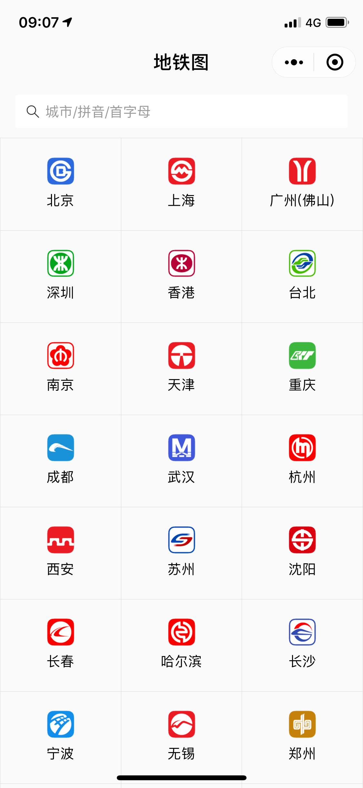
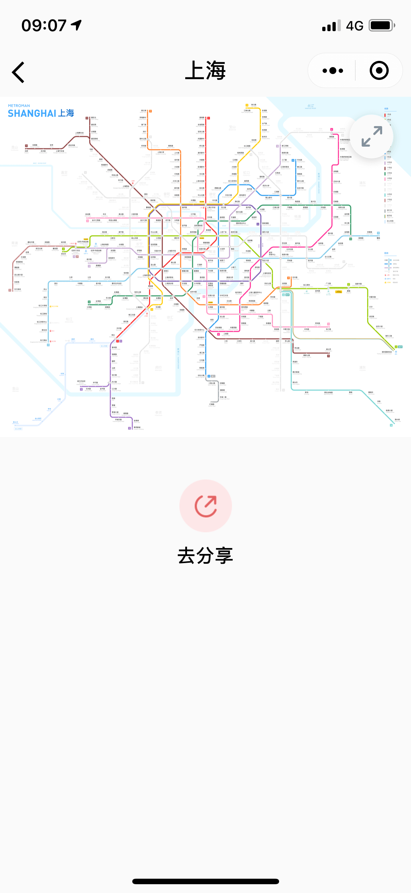
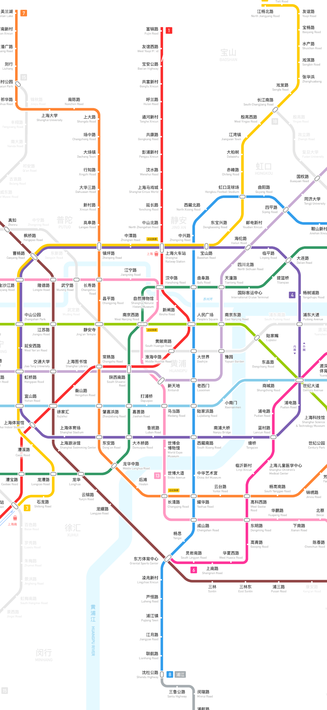
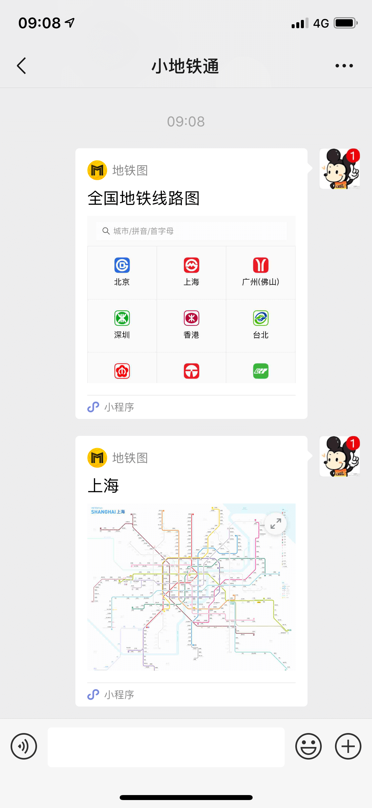

# 地铁图开源小程序

本项目介绍了如何配置并发布一个属于自己的地铁小程序。

## 截图

## 概述

很多 设计师&地铁迷 绘制了自己风格的地铁线路图，但是苦于缺乏技术人员的帮助，无法提供高效的展示程序。

本项目以"地铁通-MetroMan"开发的"地铁图"微信小程序为demo，详细介绍了如何利用本程序提供的开源代码，注册配置发布自己的地铁小程序。

## 具体步骤

1. 注册小程序账号
2. 申请小程序
3. 安装小程序开发工具
4. 配置小程序源代码
5. 预览并发布小程序

### 1. 注册小程序账号

进入[小程序注册页](https://developers.weixin.qq.com/miniprogram/dev/quickstart/basic/getstart.html#%E7%94%B3%E8%AF%B7%E5%B8%90%E5%8F%B7) 根据指引填写信息和提交相应的资料，就可以拥有自己的小程序帐号。

### 2. 申请小程序

注册成功后，登陆[小程序管理平台](https://mp.weixin.qq.com/)，申请你的小程序，管理权限，查看数据报表，发布小程序等操作。

#### 注意点

a) 一个小程序账号仅能申请一个小程序

b) 小程序名称是唯一的，不能申请其他开发者已申请的名称，申请后改名手续非常繁琐，尽量一次到位

c) 所有信息务必如实填写，如：姓名，身份证，手机号码等

d) 申请成功后会得到一个"AppID(小程序ID)"，例如：wx3c618f2bd6a*****，记下这个ID，后续配置代码时需要用到

### 3. 安装小程序开发工具

前往 [开发者工具下载页面](https://developers.weixin.qq.com/miniprogram/dev/devtools/download.html?t=19040917) ，根据自己的操作系统下载对应的安装包进行安装。

打开小程序开发者工具，用微信扫码可登录开发者工具。

无须担心，我们不编写任何代码，只是使用这个开发者工具导入本项目的源代码。

使用该工具，修改配置完成后，可以方便我们上传到自己的微信测试，以及使用Menu栏的上传按钮提交给微信团队审核。

### 4. 配置小程序源代码

编辑中...

### 5. 预览并发布小程序

编辑中...

## 祝你好运

玩得开心，也请记得给我反馈。如果您发现了什么 bug (这简直是必然的)，请直接指出，如果还能附带一个 pull request 修正的话，那真的感激万分！

欢迎加颗星星或者 follow 我一下以示支持，这将对我和我的项目的发展提供不可估量的帮助。再次感谢。

E-Mail : metromancn@gmail.com

QQ交流群 : 5151538

## 许可
MIT License

